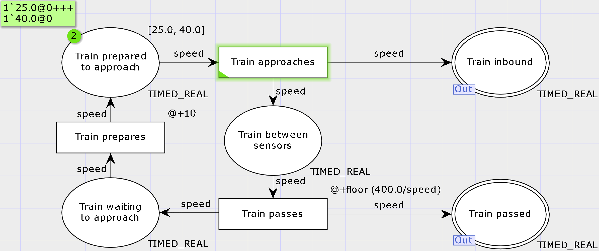
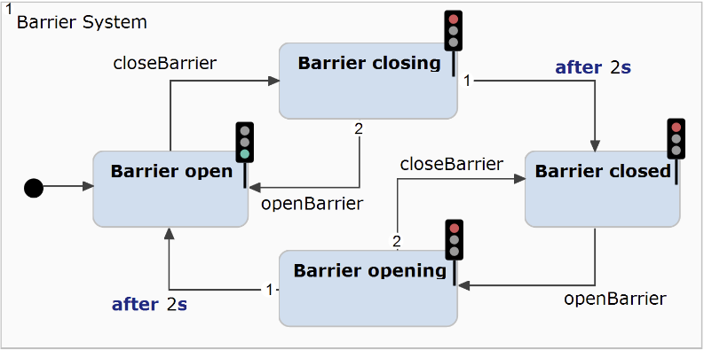
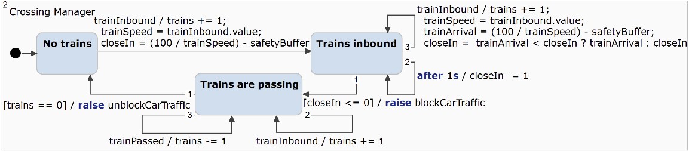

# Maude Implementation

The implementation of our approach in Maude and its application to the use case is described in these artifacts.

## Prerequisites

1. **Install Maude** 3.4 or higher according to the [installation instructions](https://maude.cs.illinois.edu/wiki/Maude_download_and_installation).
   To run Maude on Windows, we recommend the [Windows Subsystem for Linux (WSL)](https://learn.microsoft.com/en-us/windows/wsl/install).

2. **Test your Maude installation** by running the following command (WSL or Linux):
```bash
maude
```

It should return the following (Version 3.4 or higher):

```text
❯ maude
                     \||||||||||||||||||/
                   --- Welcome to Maude ---
                     /||||||||||||||||||\
             Maude 3.4 built: Mar 15 2024 20:07:12
             Copyright 1997-2024 SRI International
                   Fri Oct  4 13:41:25 2024
```

You can use **q** to exit maude.

## Overview

The subfolders contain the following information:

- **bpmn**: Contains BPMN semantics implemented in Maude which are integrated into our approach but not discussed in the paper.
- **broker**: Contains the implementation of the broker metamodel and language adapters in _broker-def.maude_, the application of our implementation to the use case in _use-case_, and some simpler examples of coordination between heterogeneous languages in _examples_.
- **common**: Contains the definition of the overall system in Maude including the global clock and time advancement (**tick rule**) in _common.maude_.
- **cpn**: Contains the implementation of CPN semantics (only a subset) in Maude along with various simple examples to test the implementation.
- **lts**: Contains an implementation of labeled transition systems (LTS) in Maude, which exposed synchronous communication, which we also investigated and integrated into our framework. However, these preliminary results are not discussed in the paper.
- **statechart**: Contains the implementation of SC semantics (only a subset) in Maude along with various simple examples to test the implementation.

## Use case

Run the verification of the use case properties using the following command.
```bash
cd broker/use-case
maude run-use-case.maude
```

<details>
  <summary>Click to see output</summary>

  ```text
❯ maude run-use-case.maude
                     \||||||||||||||||||/
                   --- Welcome to Maude ---
                     /||||||||||||||||||\
             Maude 3.4 built: Mar 15 2024 20:07:12
             Copyright 1997-2024 SRI International
                   Mon Oct  7 14:47:16 2024
==========================================
reduce in MODEL-CHECK : modelCheck(systemConfiguration, []~ Train-count-negative) .
rewrites: 22856 in 60ms cpu (64ms real) (380933 rewrites/second)
result Bool: true
==========================================
reduce in MODEL-CHECK : modelCheck(systemConfiguration, []~ (Train-passing /\ Barriers-open)) .
rewrites: 22457 in 60ms cpu (58ms real) (374283 rewrites/second)
result Bool: true
==========================================
reduce in MODEL-CHECK : modelCheck(systemConfiguration, []~ (Train-passing /\ Barrier-closing)) .
rewrites: 22457 in 60ms cpu (61ms real) (374283 rewrites/second)
result Bool: true
==========================================
reduce in MODEL-CHECK : modelCheck(systemConfiguration, [](Barriers-closed -> <> Barriers-open)) .
rewrites: 22646 in 70ms cpu (61ms real) (323514 rewrites/second)
result Bool: true
==========================================
reduce in MODEL-CHECK : modelCheck(systemConfiguration, [](Train-Inbound-Packet -> <> Barriers-closed)) .
rewrites: 22690 in 60ms cpu (60ms real) (378166 rewrites/second)
result Bool: true
==========================================
search in MODEL-CHECK : systemConfiguration =>! S .

Solution 1 (state 403)
states: 404  rewrites: 22041 in 60ms cpu (59ms real) (367350 rewrites/second)
S --> {< a : CPN |
  places : (place("Train between sensors", "Train approaches -> Train between sensors", "Train between sensors -> Train passes", INT), place("Train inbound", "Train approaches -> Train approaching", empty, INT), place("Train passed",
    "Train passes -> Train passed", empty, INT), place("Train prepared to approach", "Train prepares -> Train prepared to approach", "Train prepared to approach -> Train approaches", INT), place("Train waiting to approach",
    "Train passes -> Train waiting to approach", "Train waiting to approach -> Train prepares", INT)),
  transitions : (transition("Train approaches", "Train prepared to approach -> Train approaches", ("Train approaches -> Train approaching", "Train approaches -> Train between sensors"), @+ const(0)), transition("Train passes",
    "Train between sensors -> Train passes", ("Train passes -> Train passed", "Train passes -> Train waiting to approach"), @+ (const(400) /' speed)), transition("Train prepares", "Train waiting to approach -> Train prepares",
    "Train prepares -> Train prepared to approach", @+ const(10))),
  arcs : (arc("Train approaches -> Train approaching", "Train approaches", "Train inbound", varExpression(speed)), arc("Train approaches -> Train between sensors", "Train approaches", "Train between sensors", varExpression(speed)), arc(
    "Train between sensors -> Train passes", "Train between sensors", "Train passes", varExpression(speed)), arc("Train passes -> Train passed", "Train passes", "Train passed", varExpression(speed)), arc("Train passes -> Train waiting to approach",
    "Train passes", "Train waiting to approach", varExpression(speed)), arc("Train prepared to approach -> Train approaches", "Train prepared to approach", "Train approaches", varExpression(speed)), arc("Train prepares -> Train prepared to approach",
    "Train prepares", "Train prepared to approach", varExpression(speed)), arc("Train waiting to approach -> Train prepares", "Train waiting to approach", "Train prepares", varExpression(speed))) >
< ai : CPNInstance |
  cpn : a,
  marking : (token("Train prepared to approach", data(25), 78), token("Train prepared to approach", data(40), 80)) >
< barrierSystem : StateChart |
  transitions : ("Barrier closed" - event("openBarrier") / noEffect -> "Barrier opening", "Barrier closing" - event("openBarrier") / noEffect -> "Barrier open", "Barrier closing" - after(2) / noEffect -> "Barrier closed", "Barrier open" - event(
    "closeBarrier") / noEffect -> "Barrier closing", "Barrier opening" - event("closeBarrier") / noEffect -> "Barrier closed", "Barrier opening" - after(2) / noEffect -> "Barrier open") >
< bsi : SCInstance |
  sc : barrierSystem,
  state : scToken("Barrier open", 0),
  variables : none >
< crossingManager : StateChart |
  transitions : ("No trains" - event("trainInbound") / trainSpeed = "trainInbound" . value ; (trains = trains +' 1 ; (closeIn = trainSpeed /' 200 ; closeIn = closeIn -' safetyBuffer)) -> "Trains inbound", "Trains are passing" - event("trainInbound") /
    trains = trains +' 1 -> "Trains are passing", "Trains are passing" - event("trainPassed") / trains = trains -' 1 -> "Trains are passing", "Trains are passing" - [trains == 0] / raise "unblockCarTraffic" ; (trainSpeed = 0 ; (trainArrival = 0 ;
    closeIn = 0)) -> "No trains", "Trains inbound" - event("trainInbound") / trainSpeed = "trainInbound" . value ; (trains = trains +' 1 ; (trainArrival = trainSpeed /' 200 ; (trainArrival = closeIn -' safetyBuffer ; closeIn = trainArrival <' closeIn
    ? trainArrival : closeIn))) -> "Trains inbound", "Trains inbound" - [closeIn <=' 0] / raise "blockCarTraffic" -> "Trains are passing", "Trains inbound" - after(1)[closeIn >=' 1] / closeIn = closeIn -' 1 -> "Trains inbound") >
< cmi : SCInstance |
  sc : crossingManager,
  state : scToken("No trains", 2),
  variables : ([closeIn : 0], [trains : 0], [trainSpeed : 0], [trainArrival : 0], [safetyBuffer : 1]) >
< pools : EventPools |
  pools : (evpool("blockCarTraffic", nil), evpool("closeBarrier", nil), evpool("openBarrier", nil), evpool("trainInbound", nil), evpool("trainPassed", nil), evpool("unblockCarTraffic", nil)) >
< br : Broker |
  in : noPackets,
  out : noPackets,
  bindings : ("Train inbound" -> "trainInbound", "Train passed" -> "trainPassed", "blockCarTraffic" -> "closeBarrier", "unblockCarTraffic" -> "openBarrier") >, 72}

No more solutions.
states: 404  rewrites: 22041 in 60ms cpu (60ms real) (367350 rewrites/second)
Maude>
```
</details>

Make sure to have the most-recent Maude version installed (we used **Maude 3.4**).


### CPN model
CPN model. See executable source of the model for **CPN Tools** [here](./cpn/examples/source/use-case.cpn).


### Barrier System SC model.



Executable file for **itemis CREATE** available [here](./broker/use-case/images/barrier-system-crossing-manager.ysc).

### Crossing Manager SC model.



Executable file for **itemis CREATE** available [here](./broker/use-case/images/barrier-system-crossing-manager.ysc).

